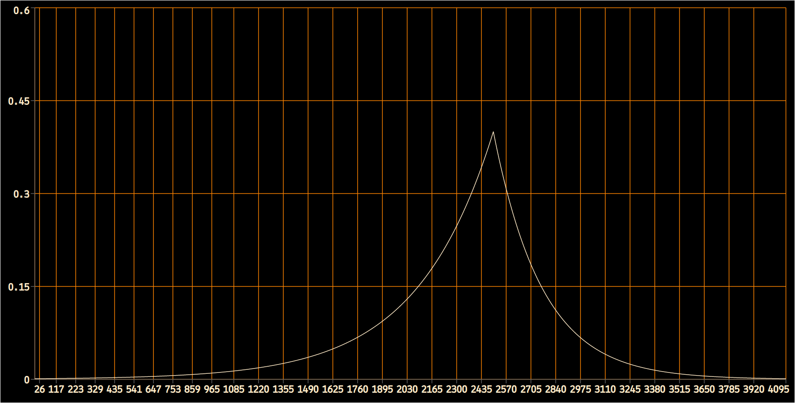
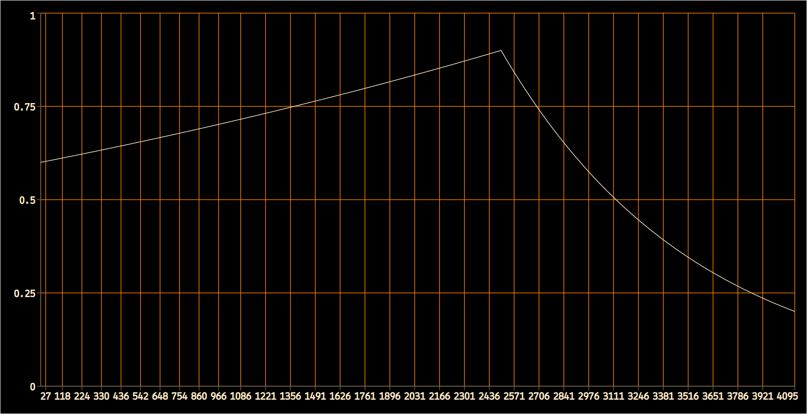
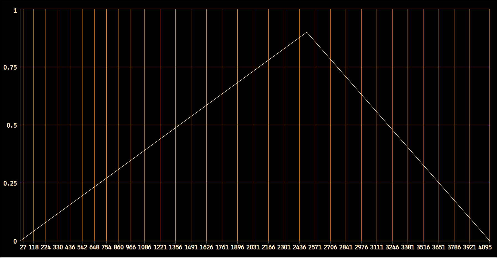
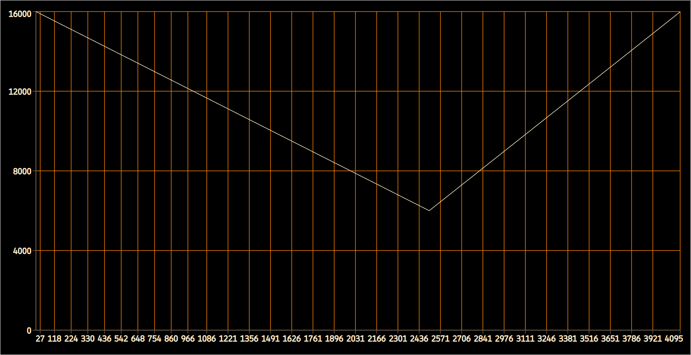

# 
Reverb con Valores Variables

 



## Click para ver <a href="#" onclick="document.getElementById('loadDiv').style.display='block';">Diagrama de Bloques</a>

 

| Campo-p  | Descripción                                                                               | Ejemplo |
| :------: | :---------------------------------------------------------------------------------------- | ------- |
|   -p4    | Tabla con valores para el control del tamaño de la sala en el rango [0 - 1].              |    -2   |
|   -p5    | Tabla con las frecuencias de corte para el control del RT de las frecuencias más agudas.  |    -3   |

 

## Notas

* Este es el mismo instrumento usado para demostrar la reverb con valores fijos.

* En este ejemplo usaremos como fuente sonora una sinusoide de amplitud variable (ver tabla 1) creada con el instrumento "Aditiva". El envío a la reverb variará según la tabla 2.
  
* Usando valores negativos para p4 y/o p5 podemos pasar tablas con valores que varían para cada uno de los dos campos-p mencionados.

  * El tamaño de la sala (ver tabla 3) comenzará y terminará en 0, pero en su punto máximo alcanzará el equivalente al valor dado para un hall grande.
  
  * La frecuencia de corte de los filtros de control del registro agudo variará según la tabla 4.

  * No es necesario usar tablas en ambos simultáneamente. Se podría, por ejemplo, aplicar sólo una envolvente al control del tamaño de la sala y dejar el control de atenuación de las frecuencias agudas con un valor fijo.

 

## Tablas

Las tablas usadas en el ejemplo serán leídas una sóla vez (freq=1/p3) y por tanto debemos darle un tamaño del tipo 2n + 1.
 * <b>f1</b>:

 * <b>f2</b>:

 * <b>f3</b>:

 * <b>f4</b>:

 
 

