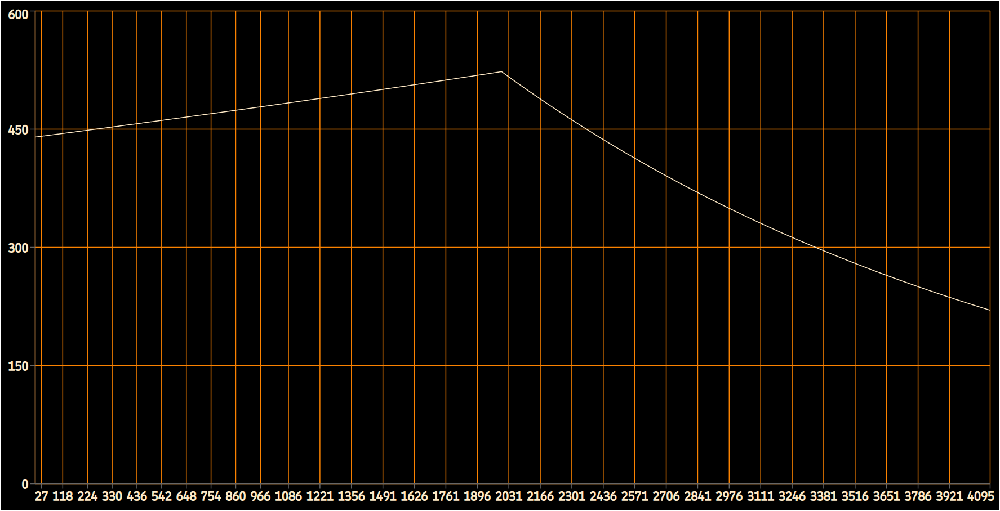

# 
Síntesis Aditiva con Valores Variables

 



## Click para ver <a href="#" onclick="document.getElementById('loadDiv').style.display='block';">Diagrama de Bloques</a>

 

| Campo-p  | Descripción                                       | Ejemplo |
| :------: | :------------------------------------------------ | ------- |
|  -p4     | Número de tabla con valores de amplitud.          |     -4  |
|  -p5     | Número de tabla con valores de frecuencia.        |     -5  |
|   p6     | Factor multiplicador de la amplitud.              |      1  |
|   p7     | Factor multiplicador de la frecuencia.            |      1  |
|  -p8     | Número de tabla con valores de paneo.             |     -6  |
|  -p9     | Número de tabla con factores de envío a la reverb.|     -7  |
|   p10    | Número de la tabla que contiene la forma de onda. |     -1  |
|   p11    | Fase inicial.                                     |      0  |

 

## Notas

* Este es el mismo instrumento usado para realizar la síntesis aditiva con valores fijos.
  
* Usando valores negativos para p4, p5, p8 y/o p9 podemos pasar tablas con valores que varían para cada uno de los cuatro campos-p mencionados.

  * No es necesario usar tablas en todos ellos. Se podría, por ejemplo, aplicar sólo una envolvente de amplitud y dejar el resto de los campos-p con valores fijos.
  

 

## Tablas

Las tablas usadas en el ejemplo serán leídas una sóla vez (freq=1/p3) y por tanto debemos darle un tamaño del tipo 2n + 1.
 * <b>f1</b>:

 * <b>f2</b>:

 * <b>f5</b>:

 * <b>f20</b>:

 
 

