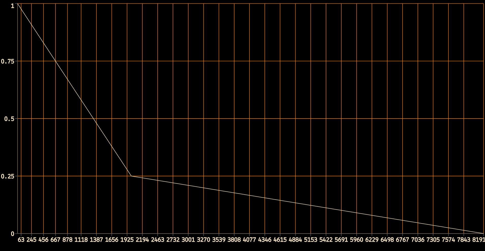
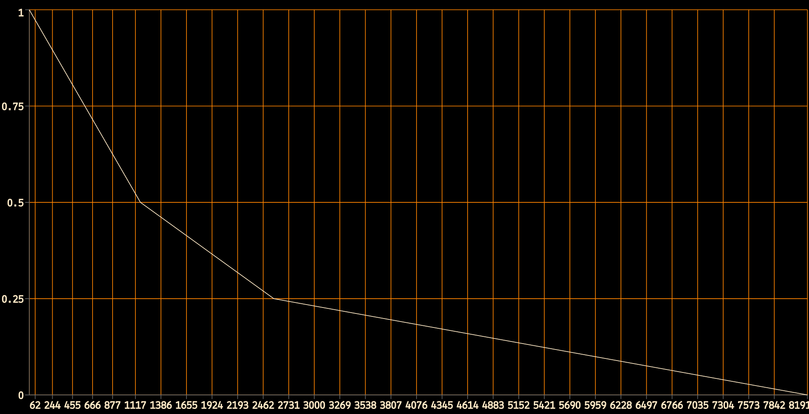
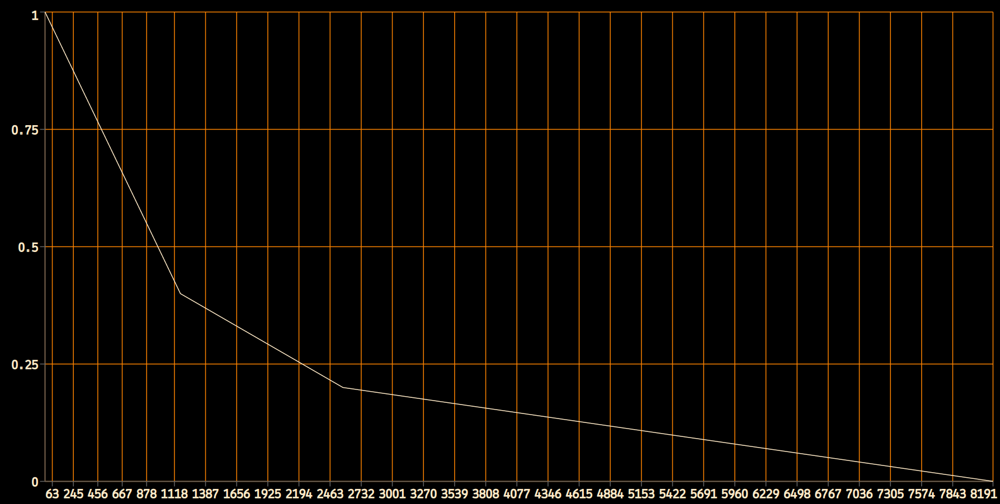
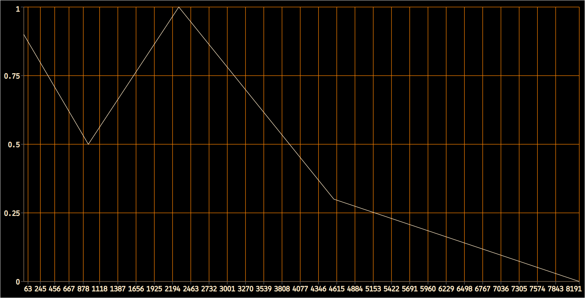
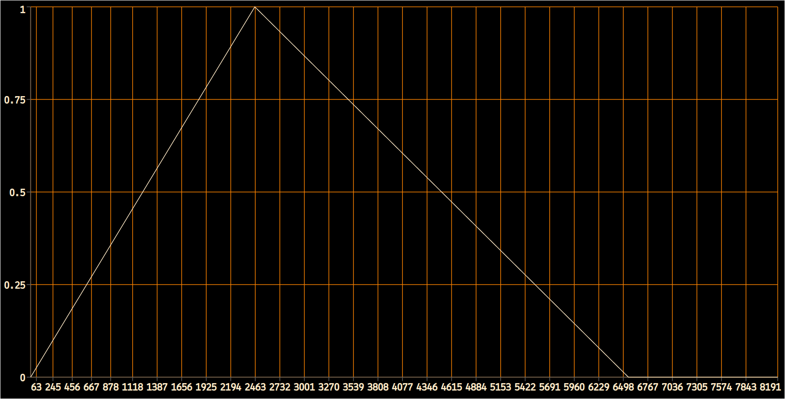
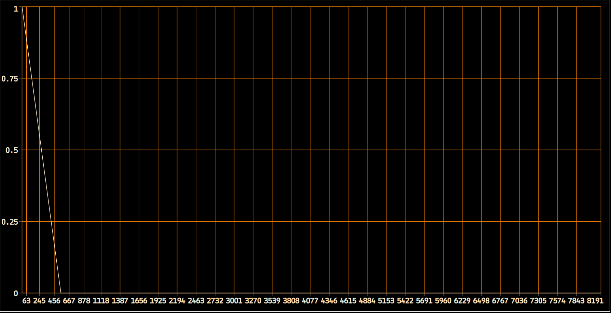

# 
Síntesis FM tipo Turenas

 



## Click para ver <a href="#" onclick="document.getElementById('loadDiv').style.display='block';">Diagrama de Bloques</a>

 

| Campo-p  | Descripción                                     | Ejemplo |
| :------: | :---------------------------------------------- | ------- |
|   p4     | Amplitud en dBFS.                               |    -22  |
|   p5     | Frecuencia portante.                            |   1278  |
|   p6     | Divisor de la frecuencia portante.              |  0.896  |
|   p7     | Índice de modulación máximo.                    |    2.5  |
|   p8     | Índice de modulación mínimo.                    |      0  |
|   p9     | Función de envolvente de intensidad.            |      2  |
|   p10    | Función de envolvente de índice de modulación.  |      6  |
|   p11    | Localización en la imágen estéreo [L:0 - R:1].  |    0.5  |
|   p12    | Envío a la reverberación expresado como factor. |    0.8  |

 

## Tablas

Las tablas usadas en el ejemplo, tanto para la envolvente de intensidad como para la del índice de modulación, serán leídas una sóla vez (freq=1/p3) y por tanto debemos darle un tamaño del tipo 2n + 1.
 * <b>f2</b>:

 * <b>f3</b>:

 * <b>f4</b>:

 * <b>f5</b>:

 * <b>f6</b>:

 * <b>f7</b>:

 

